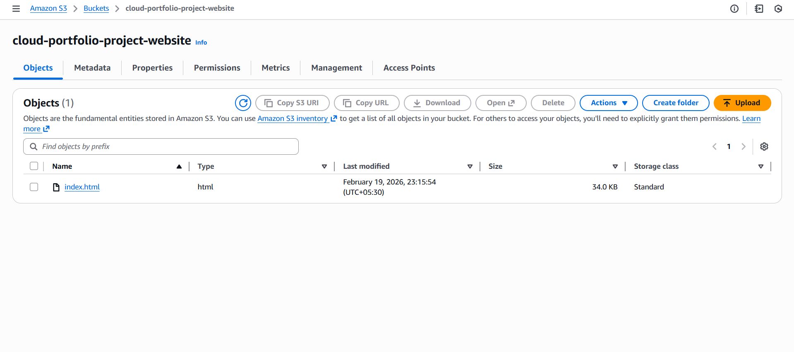
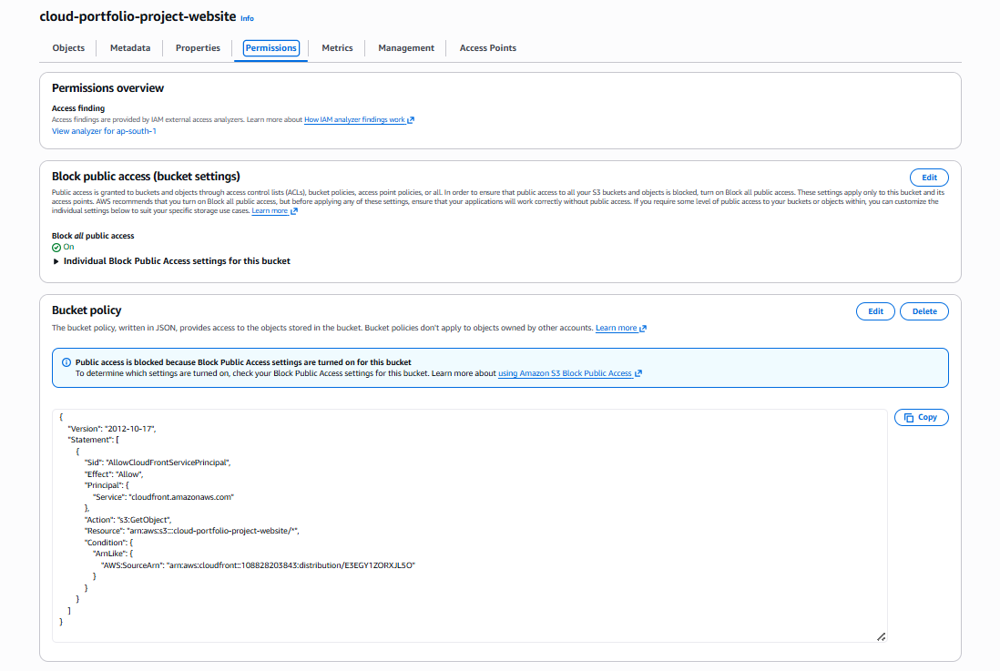
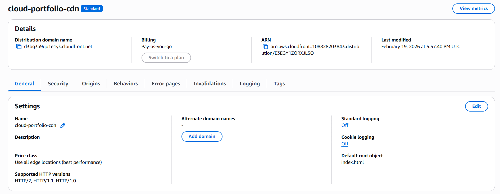
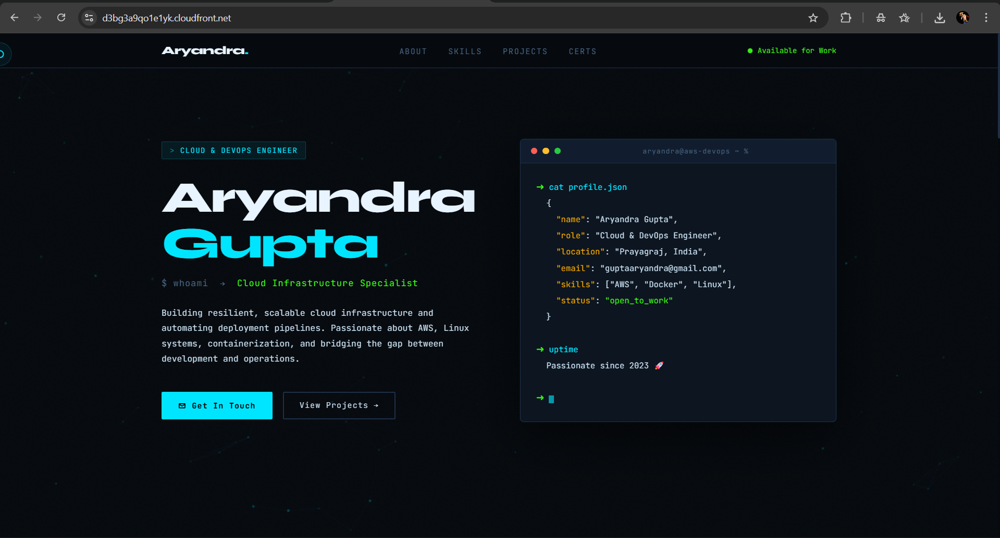

AWS Static Website Deployment using S3 & CloudFront

📌 Project Overview

Deployed a production-style static website using Amazon S3 and CloudFront CDN. Implemented secure access using Origin Access Control and enabled HTTPS redirection.

🏗 Architecture

User
↓
CloudFront (CDN + HTTPS)
↓
Private S3 Bucket

🛠 Services Used

Amazon S3

CloudFront

IAM

Origin Access Control (OAC)

🔐 Security Implementation

Disabled public S3 access

Configured CloudFront Origin Access Control

Restricted S3 access to CloudFront only

Enabled HTTPS redirection

⚙ Implementation Steps

Created IAM admin user

Created S3 bucket

Uploaded static website files

Configured bucket policy

Created CloudFront distribution

Enabled HTTPS redirection

Set default root object

Verified secure access

## S3 Bucket Configuration

## S3 Permissions

## CloudFront Distribution

## Live Website

🌍 Outcome

Website accessible globally via CloudFront

Secure HTTPS communication

Private S3 bucket

Production-style deployment architecture
